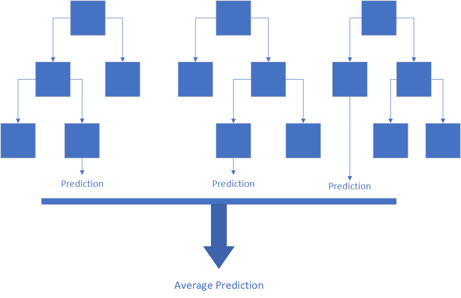
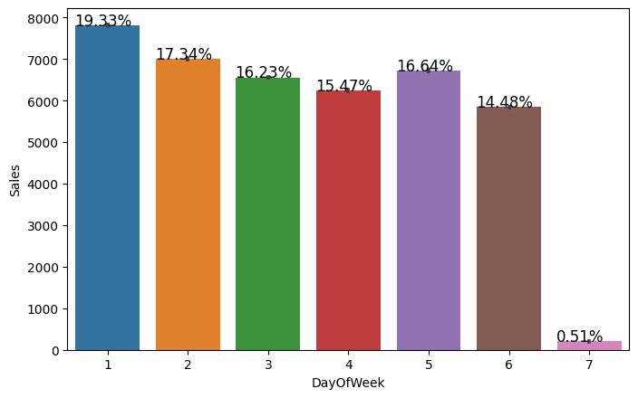
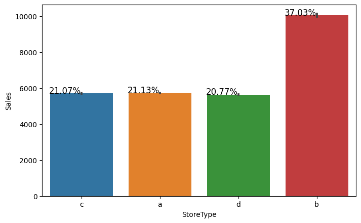
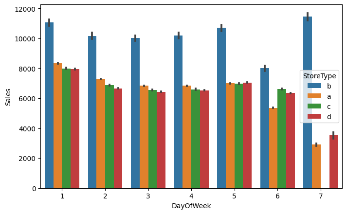
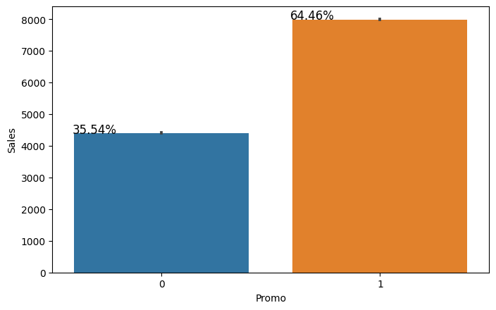
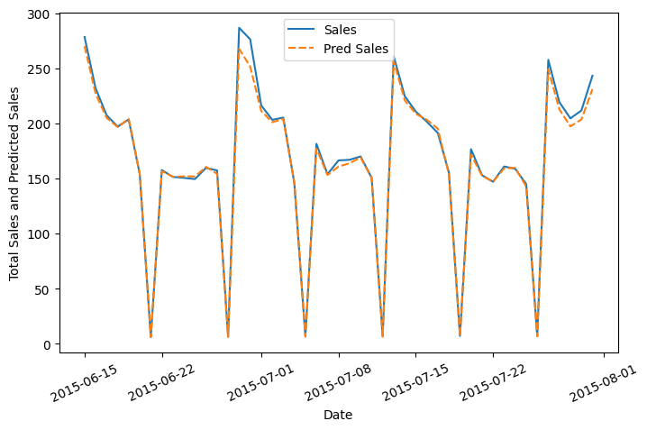

 
  

<h1 align="center"> Retail Sales Prediction </h1>
<h3 align="center"> AlmaBetter Verified Project - <a href="https://www.almabetter.com/"> AlmaBetter School </a> </h5>

 

<h2> Problem Statement and Project Description</h2>

Retail Sales Prediction is a regression machine learning project. Rossmann operates over 3,000 drug stores in 7 European countries. Currently, Rossmann store managers are tasked with predicting their daily sales for up to six weeks in advance. Store sales are influenced by many factors, including promotions, competition, school and state holidays, seasonality, and locality. With thousands of individual managers predicting sales based on their unique circumstances, the accuracy of results can be quite varied. You are provided with historical sales data for 1,115 Rossmann stores. The task is to forecast the "Sales" column for the test set. Note that some stores in the dataset were temporarily closed for refurbishment.

Businesses use sales forecasts to determine what revenue they will be generating in a particular timespan to empower themselves with powerful and strategic business plans. Important decisions such as budgets, hiring, incentives, goals, acquisitions and various other growth plans are affected by the revenue the company is going to make in the coming months and for these plans to be as effective as they are planned to be it is important for these forecasts to also be as good.

The work here forecasts the sales of the various Rossmann stores across Europe for the recent six weeks and compares the results from the models developed with the actual sales values.

<h2> :floppy_disk: Project Files Description</h2>

This project contains two executable file, a technical document and a presentation as follows:

<h4>Executable Files:</h4>
<ul>
  <li><b>Rossmann_Sales_Prediction_Vithika_Karan.ipynb</b> - Google Collab notebook containing data summary, exploration, visualisations and modeling.</li>
  <li><b>Rossmann_Sales_Prediction_Part_2_Vithika_Karan_ipynb.ipynb</b> - Google Collab notebook containg model hyperparameter tuning, model performance, evaluation and conclusion.</li>
</ul>

<h4>Documentation:</h4>
<ul>
  <li><b>Technical Documentation.pdf</b> - Includes the complete documentation about the project.</li>
  <li><b>Project Presentation.pdf</b> - Presentation of the same.</li>
</ul>

<h4>Source Directory:</h4>
<ul>
  <li><b>Data & Resources.zip</b> - Includes sales data and store data for various Rossmann stores.</li>
</ul>

<h2> :book: Random Forest</h2>

Random forest is a supervised learning algorithm. It creates a "forest" out of an ensemble of decision trees, which are commonly trained using the "bagging" method. The bagging method's basic premise is that combining different learning models improves the overall output.
Simply said, random forest combines many decision trees to produce a more accurate and stable prediction.

Furthermore, the random forest classifier is efficient, can handle a large number of input variables, and provides correct predictions in most cases. It's a very strong tool that doesn't require any coding to implement.

<h2> :chart_with_upwards_trend: Exploratory Data Analysis</h2>

There were more sales on Monday, probably because shops generally remain closed on Sundays which had the lowest sales in a week. 
Store type B though being few in number had the highest sales average. The reasons include all three kinds of assortments specially assortment level b which is only available at type b stores and being open on sundays as well.
The outliers in the dataset showed justifiable behaviour. The outliers were either of store type b or had promotion going on which increased sales.

 

Store type B was open on all seven days of the week and had more sales than any other store type and promotion had a positive effect across all store types.

 

<h2> :chart_with_upwards_trend: Results</h2>

Random Forest Tuned Model gave the best results and the patterns that could be captured by the model without overfitting was captured achieving a R^2 of 0.95 which helps in allocation of resources and proper planning for the company's growth.
            

<!-- CREDITS -->
<h2 id="credits"> :scroll: Credits</h2>

< Vithika Karan > | Keen Learner | Business Analyst | Data Scientist | Machine Learning Enthusiast

 <i> Contact me for Data Science Project Collaborations</i>

<h2> :books: References</h2>
<ul>
  <li>
Andrew Udell, 'Predicting E-Commerce Sales with Random Forest'. [Online].

      
Available: https://towardsdatascience.com/predicting-e-commerce-sales-with-a-random-forest-regression-3f3c8783e49b

  </li>
  <li>
Builtin.com, 'Random Forest'. [Online].

      
Available: https://builtin.com/data-science/random-forest-algorithm

  </li>
  <li>
Machine Learning Mastery, 'Random Forest for Time Series Prediction'. [Online].

      
Available: https://machinelearningmastery.com/random-forest-for-time-series-forecasting/

  </li>

